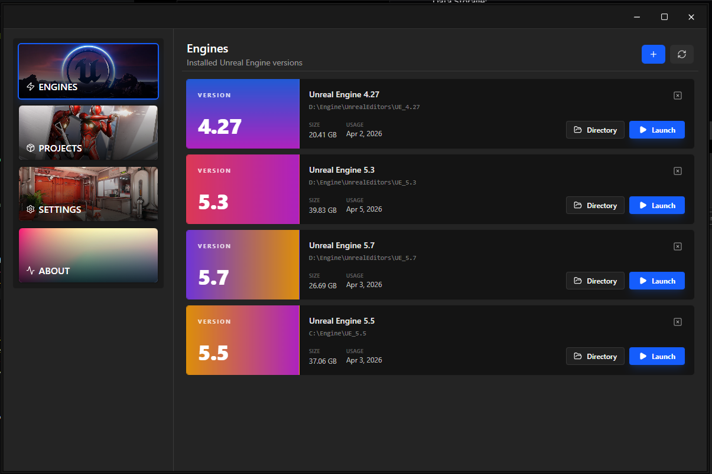
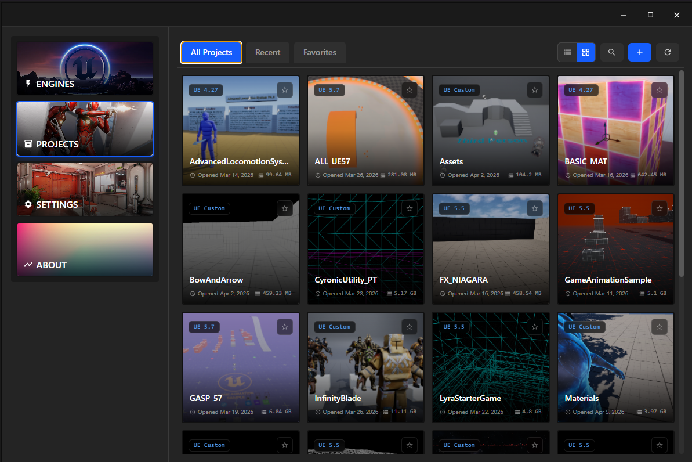

# 🚀 Unreal Launcher

> A lightweight Electron desktop app for discovering, launching, and managing Unreal Engine installations and projects — no Epic Games Launcher required.

---




## What it does

**Unreal Launcher** replaces the Epic Games Launcher for day-to-day UE development. It auto-scans your drives for installed engines and `.uproject` files, lets you launch them with one click, and stays out of your way.

**Stack:** TypeScript · React 19 · Electron 39 · Vite 7 · Tailwind CSS 4 · Zustand · Framer Motion · Rust (napi-rs)

---

## Features

|     | Feature             | Description                                                            |
| --- | ------------------- | ---------------------------------------------------------------------- |
| ⚡  | One-Click Launch    | Start any engine or project instantly                                  |
| 🔍  | Auto-Scan           | Discovers UE4 & UE5 installs and `.uproject` files automatically       |
| 🗂️  | List & Grid View    | Toggle between layouts for projects, preference persisted              |
| ⭐  | Favorites & Recent  | Pin projects and track recently opened ones by actual timestamp        |
| 🔎  | Search              | Filter projects by name                                                |
| 💾  | Size Calculation    | Background folder size calculation via worker threads                  |
| 🦀  | UE Tracer           | Rust background process tracking engine/project usage                  |
| 🎨  | Theme System        | Built-in themes, per-token overrides, border radius, saveable profiles |
| 🔤  | Font Customization  | Choose font family and size for the entire UI                          |
| 📐  | Resizable Sidebar   | Drag to resize or collapse                                             |
| 🔔  | Toast Notifications | Stacking real-time feedback with auto-dismiss                          |
| 🔄  | Auto Updates        | GitHub Releases-based updates via `electron-updater`                   |
| 🔒  | Single Instance     | Second launch focuses the existing window                              |
| 🛡️  | Error Boundary      | Recoverable crash screen instead of blank window                       |

---

## Quick Start

### Prerequisites

- Node.js 18+
- Rust toolchain (for native modules & tracer)
- npm

### Setup

```bash
git clone https://github.com/NeelFrostrain/UnrealLauncher.git
cd UnrealLauncher
npm install
```

### Development

```bash
npm run dev
```

### Preview production build

```bash
npm run start
```

---

## Building

```bash
# Full production build (tracer + app)
npm run build

# Platform packages
npm run build:win    # Windows installer (.exe)
npm run build:mac    # macOS (.dmg)
npm run build:linux  # Linux (AppImage/DEB/RPM)

# Unpacked (no installer, useful for testing)
npm run build:unpack
```

See [BUILD.md](BUILD.md) for the full build guide including native modules and the Rust tracer.

---

## Scripts

| Command                | Description                    |
| ---------------------- | ------------------------------ |
| `npm run dev`          | Start in development mode      |
| `npm run start`        | Preview production build       |
| `npm run build`        | Build for current platform     |
| `npm run build:win`    | Windows installer              |
| `npm run build:mac`    | macOS package                  |
| `npm run build:linux`  | Linux package                  |
| `npm run build:native` | Build Rust N-API native module |
| `npm run build:tracer` | Build Rust tracer executable   |
| `npm run typecheck`    | TypeScript type checking       |
| `npm run lint`         | Run ESLint                     |
| `npm run format`       | Format with Prettier           |
| `npm run clean`        | Remove build artifacts         |

---

## Project Structure

```
UnrealLauncher/
├── native/              # Rust N-API native module (filesystem ops)
├── tracer/              # Rust background tracer process
├── resources/           # Packaged assets (icons, tracer binary)
├── src/
│   ├── main/            # Electron main process
│   │   ├── index.ts     # Entry, protocol, single instance
│   │   ├── ipcHandlers.ts
│   │   ├── store.ts     # Data persistence (engines/projects/settings)
│   │   ├── updater.ts
│   │   ├── utils.ts
│   │   └── window.ts
│   ├── preload/         # IPC bridge (contextBridge)
│   └── renderer/        # React UI
│       └── src/
│           ├── components/
│           │   ├── about/
│           │   ├── engines/
│           │   ├── layout/
│           │   ├── projects/
│           │   ├── settings/
│           │   └── ui/
│           ├── pages/   # Engines, Projects, Settings, About
│           ├── store/   # Zustand (page navigation)
│           └── utils/   # Theme, settings, helpers
├── electron.vite.config.ts
├── electron-builder.yml
└── package.json
```

---

## Data Storage

App data is stored in Electron's `userData` directory:

```
%APPDATA%\unreal-launcher\
├── save\
│   ├── engines.json
│   ├── projects.json
│   └── settings.json
└── Tracer\
    ├── engines.json
    └── projects.json
```

---

## Contributing

See [CONTRIBUTING.md](CONTRIBUTING.md) for the full guide.

1. Fork the repo
2. Create a branch: `git checkout -b feature/your-feature`
3. Run `npm run typecheck && npm run lint` before committing
4. Open a pull request

---

## License

MIT — see [LICENSE](LICENSE)

---

## Support

- 🐛 [Open an Issue](https://github.com/NeelFrostrain/UnrealLauncher/issues)
- 💬 [Discussions](https://github.com/NeelFrostrain/UnrealLauncher/discussions)
- 📧 nfrostrain@gmail.com
- ☕ [Ko-fi](https://ko-fi.com/neelfrostrain)

<div align="left">
  <p>Made by <a href="https://github.com/NeelFrostrain">Neel Frostrain</a></p>
</div>
